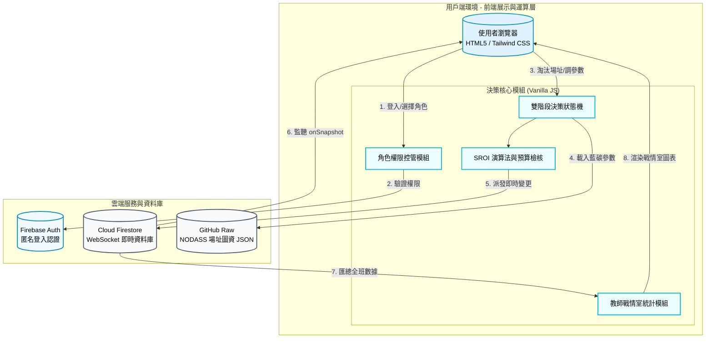

# 碳吉 TanJi：藍碳特搜隊 🌊

## 1. 專案介紹

### 1.1 系統目的簡介

本系統為「115 年度 NODASS 大數據競賽」專屬之藍碳復育決策模擬器。透過「**大數據探勘 (Data Mining)**」、「**角色扮演 (Role-Play)**」與「**多端即時協作 (Real-time Collaboration)**」三大核心機制，引導學生模擬真實世界中推動海洋藍碳（Blue Carbon）復育專案時的跨域決策挑戰。

小組成員將擔任海洋物理員、海洋生態員、社會溝通員、財務長與政策分析師（隊長）。決策分為兩階段：第一階段需利用 NODASS 數據淘汰不適宜的海岸；第二階段則需在鎖定的場址中，妥善分配工程、生態與溝通預算，系統將即時推算專案的 **SROI（社會投資報酬率）**。同時提供教師專屬戰情室，即時監控全班決策數據與綜合排行。

---

## 2. 系統架構與範圍

### 2.1 系統架構圖

本系統採用 **純前端架構 + Firebase 雲端即時資料庫** 設計，透過無伺服器（Serverless）架構實現跨裝置的毫秒級狀態同步。

### 2.2 系統範圍

* **展示層**: 使用 Tailwind CSS 打造以「海洋藍」為基調的高流暢度響應式介面，整合 `Chart.js` 呈現即時互動雷達圖（SROI）與戰情大數據圖表。
* **業務邏輯層**: 包含 5 種角色權限劃分、2 大決策階段（大排雷與資源配置），以及涵蓋環境效益 (Env)、經濟效益 (Eco)、社會效益 (Soc) 與預算控制的綜合演算法。
* **資料存取層**: 透過 Fetch API 動態載入 GitHub 上的 `bluecarbon_sites.json` 場址資料，並使用 Firebase `onSnapshot` 實現 WebSockets 即時雙向狀態綁定。

---

## 3. 業務功能需求

| 需求編號 | 功能名稱 | 參與者 | 功能描述 | 業務邏輯/備註 |
| --- | --- | --- | --- | --- |
| **FR-01** | **藍碳特搜隊登入** | 學生 | 輸入小組名稱並選擇專屬職位（海洋物理員、海洋生態員、社會溝通員、財務長、政策分析師）登入。 | 教師輸入專屬代碼 `880619` 即可一鍵進入最高權限戰情室。 |
| **FR-02** | **階段一：全台大排雷** | 學生 | 顯示全台多處候選場址（包含波浪、水深、底質、成本、AIS 密度等 NODASS 數據）。各專員依自身專業審視條件，按下「加簽否決」淘汰不適宜的場址。 | 隊長無法看見詳細數據，需仰賴隊員口頭回報。當場址淘汰至剩餘 1~2 個時，隊長才可點擊「鎖定目標」進入下一階段。 |
| **FR-03** | **階段二：SROI 配置** | 學生 | 進入選定場址的戰情室。專員分別拉動「工程防護」、「生態規模」、「社區溝通」與「預算總量」滑桿。 | 系統即時依據滑桿數值與場址基底分數，重算並更新雷達圖及預算長條圖。 |
| **FR-04** | **SROI 動態評測與提交** | 系統/隊長 | 評估預算是否超支，並檢核防護力是否足以抵禦該地波浪、回饋金是否能平息該地航運(AIS)抗議。計算完成後由隊長點擊「提交最終決策」。 | 具備懲罰機制（如超支扣除經濟分、防護不足扣除環境分）。隊長可隨時撤回重改。 |
| **FR-05** | **教師戰情總覽** | 教師 | 戰情室即時呈現：在線組數、最終選址分佈（圓餅圖）、平均 SROI 指標（長條圖）、各組詳細狀態與決策排行榜。 | 具備「重置」按鈕，可清空 Firebase 內所有小組進度以利下一梯次教學。 |

---

## 4. 系統演算法與模型設計

### 4.1 兩階段任務機制

* **Phase 1 (消去法)**：考驗團隊溝通。各專員只負責監控自己專業的數據，必須透過語音或實體討論交流，由隊員行使「否決權」，最終由隊長拍板定案。
* **Phase 2 (最佳化)**：考驗資源分配。需在有限預算內將 SROI 最大化。

### 4.2 SROI 計算模型與懲罰機制

系統載入外部場址資料（`NODASS_DB`）取得各場址基準分與環境變數，再疊加學生決策：

* **成本與預算 (Budget & Cost)**：
* `預算上限` = $50 + (財務長滑桿 \times 30)$
* `建置成本` = $(安全 \times 15) + (生態 \times 20) + (公關 \times 15)$
* **預算超支懲罰**：若建置成本大於預算上限，將觸發超支警告，大幅扣除「經濟效益」。

* **效益加權 (Impacts)**：
* **環境效益 (S)**：受安全與生態投入正向影響。**【懲罰】** 若該場址「波浪 >= 1.5m」且安全防護未達 4 級（強化護岸），將扣減 30 分。
* **社會效益 (O)**：受公關與生態投入正向影響。**【懲罰】** 若該場址「AIS 船舶密度 > 80」且公關回饋未達 4 級（說明會），將扣減 40 分。
* **經濟效益 (E)**：受財務寬鬆度正向影響（代表財務操作彈性），但受超支懲罰負向影響。

* **綜合 SROI 產出**： $Total = (Env \times 40\%) + (Eco \times 30\%) + (Soc \times 30\%)$

---

## 5. 非業務功能需求

### 5.1 安全性要求

* **無密碼雲端認證**: 採用 Firebase Anonymous Auth 進行安全連線，不收集學生任何個人隱私資料。
* **防衝突鎖定 (Lock)**: 非該職位的滑桿會覆蓋一層「等待操作」的毛玻璃鎖定 UI，且送出決策後全體 UI 將被強制鎖定，避免數據非同步干擾。

### 5.2 系統效能與容錯

* **外掛圖資庫**: 採用 `fetch` 非同步載入 GitHub Raw 上的 JSON 題庫檔，方便教師日後自行抽換、擴充場址參數，而無需修改系統核心程式碼。
* **單機降級模式 (Demo Mode)**: 若逢學校網路不穩、無法取得外部 JSON，或 Firebase 連線逾時，系統會自動降級為「本機模式」並載入內建的 6 筆備用場址資料，確保課堂教學不中斷。

---

## 6. 安裝與部署

### 前置需求

* 現代瀏覽器（建議 Google Chrome, Safari, Edge）。
* 若需啟用即時連線，請確保具備有效的 **Firebase 專案（開啟 Firestore 與 Anonymous Auth）**。

### 部署步驟

1. **取得原始碼**: 下載專案的 `index.html`。
2. **設定場址題庫 (選擇性)**:
* 可將自己的 `bluecarbon_sites.json` 上傳至 GitHub，並修改程式碼中 `fetch(...)` 的網址。

3. **設定 Firebase (選擇性)**:
* 在 HTML 檔案底部的 `<script type="module">` 區塊中，將 `firebaseConfig` 替換為您的專案設定。

4. **本地或線上執行**:
* 直接雙擊 `index.html` 即可使用，或將其部署至 GitHub Pages、Vercel 等靜態伺服器。

5. **教師登入戰情室**:
* 於登入畫面的「小組名稱」輸入 `880619` 即可進入大數據監控中心。
