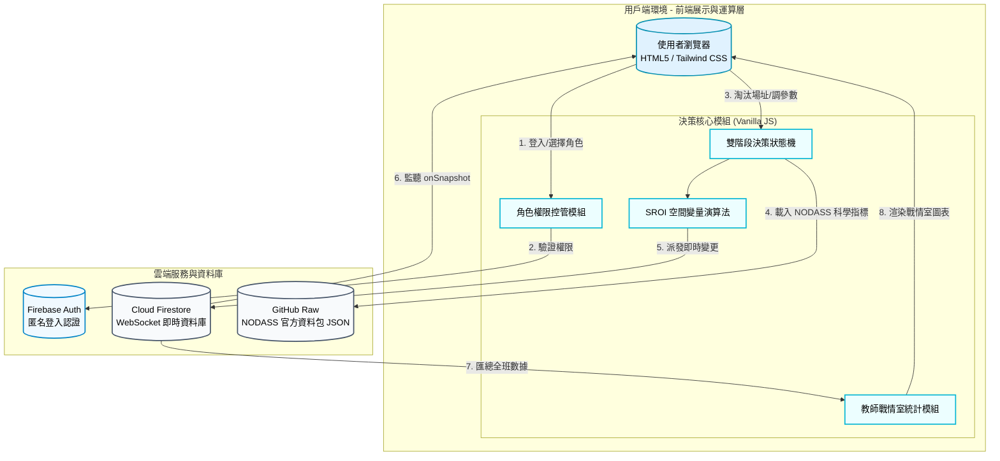

# 碳吉 TanJi：藍碳特搜隊 🌊

## 1. 專案介紹

### 1.1 系統目的簡介

本系統為國家海洋研究院「2026 諾大師海洋大數據競賽」專屬之科學教育教具與藍碳復育空間決策模擬器。系統全面導入國家海洋資料庫及共享平臺（NODASS）官方資料包所提供的實體海洋文獻與網格觀測圖資，包含科學團隊清洗提煉之三年期 AIS 船舶航跡大數據、NAMR WW3 波浪模式歷史模擬成果以及 TaiBIF 海底底拖採集紀錄。

透過「**大數據探勘 (Data Mining)**」、「**角色扮演 (Role-Play)**」與「**多端即時協作 (Real-time Collaboration)**」三大核心機制，引導學生模擬真實世界中推動海洋藍碳復育專案時的跨域決策挑戰。小組成員將擔任海洋物理員、海洋生態員、社會溝通員、財務長與政策分析師（隊長）。

決策分為兩階段：第一階段需利用官方資料包數據過濾不適宜的海岸限制；第二階段則需在選定的場址中，妥善分配工程、生態與溝通預算，系統將即時推算專案的 **SROI（社會投資報酬率）**。同時提供教師專屬戰情室，即時監控全班決策數據與綜合排行。

---

## 2. 系統架構與範圍

### 2.1 系統架構圖

本系統採用 **純前端架構 + Firebase 雲端即時資料庫** 設計，並整合 GitHub 遠端動態資料集，將官方資料包提煉之科學指標封裝為空間矩陣進行即時運算。

### 2.2 系統範圍

* **展示層**: 使用 Tailwind CSS 打造以「海洋藍」為基調的高流暢度響應式介面，整合 Chart.js 呈現即時互動雷達圖（SROI）與戰情大數據圖表。
* **業務邏輯層**: 包含 5 種角色權限劃分、2 大決策階段（空間環境篩選與資源配置），以及涵蓋環境效益、經濟效益、社會效益與包含水深地形、波浪消能及船舶碰撞變量的綜合演算法。
* **資料存取層**: 透過 Fetch API 動態載入儲存於 GitHub 上由官方資料包提煉而成的 `bluecarbon_sites.json` 空間數據集，並使用 Firebase `onSnapshot` 實現 WebSockets 即時雙向狀態綁定。

---

## 3. 業務功能需求

| 需求編號 | 功能名稱 | 參與者 | 功能描述 | 業務邏輯/備註 |
| --- | --- | --- | --- | --- |
| **FR-01** | **藍碳特搜隊登入** | 學生 | 輸入小組名稱並選擇專屬職位（海洋物理員、海洋生態員、社會溝通員、財務長、政策分析師）登入。 | 教師輸入專屬代碼 `880619` 即可一鍵進入最高權限戰情室。 |
| **FR-02** | **階段一：全台大排雷** | 學生 | 顯示全台多處候選場址。各場址之波浪、水深、底質、預算難度與船舶密度等欄位均來自官方資料包之清洗成果。各專員依自身專業審視條件，按下「宣告不宜」淘汰不適宜的場址。 | 政策分析師無法看見詳細數據，需仰賴專員口頭回報。當場址過濾篩選後，政策分析師才可點擊「鎖定目標」進入下一階段。 |
| **FR-03** | **階段二：SROI 配置** | 學生 | 進入選定場址的配置戰情室。專員分別拉動「工程防護」、「生態規模」、「社區溝通」與「預算總量」滑桿。 | 系統即時依據滑桿數值與官方資料包基礎分數，重算並更新雷達圖及預算長條圖。 |
| **FR-04** | **SROI 動態評測與結案報告** | 系統/隊長 | 評估預算是否超支，並依據官方資料包之環境變量，檢核工程防護力是否與該地波浪平衡、社區溝通是否與該地船舶活動頻率平衡。政策分析師點擊「提交最終決策」後，控制區會自動切換為「大數據空間環境分析報告」，客觀分析各場址的空間物理限制。 | 具備環境經濟學懲罰機制（如超支扣除經濟分、防護不足扣除環境分）。政策分析師可隨時撤回重改。 |
| **FR-05** | **教師戰情總覽** | 教師 | 戰情室即時呈現：在線組數、最終選址分佈（圓餅圖）、平均 SROI 指標（長條圖）、各組詳細狀態與決策排行榜。 | 具備「重置」按鈕，可清空 Firebase 內所有小組進度以利下一梯次教學。 |

---

## 4. 系統演算法與模型設計

### 4.1 兩階段任務機制

* **Phase 1 (消去法)**：考驗團隊溝通。各專員只負責監控自己專業對應的官方資料包欄位，必須透過語音或實體討論交流，由隊員行使篩選權，最終由政策分析師拍板定案。
* **Phase 2 (最佳化)**：考驗資源分配。需在有限預算內將 SROI 進行相對合理的配置。

### 4.2 SROI 計算模型與懲罰機制

系統載入官方資料包提煉之資料庫（`NODASS_DB`）取得各場址基準分與自然物理變數，再疊加學生決策：

* **成本與預算 (Budget & Cost)**：
* `預算上限` = $50 + (財務長滑桿 \times 30)$
* `建置成本` = $\text{Math.round}((\text{工程滑桿} \times 15 \times \text{水深變量}) + (\text{生態滑桿} \times 20) + (\text{公關滑桿} \times 15 \times (1 + \frac{\text{船舶密度}}{100})))$
* **水深變量計算**：官方資料包之 ETOPO 地形水深（$\text{base.depth}$）透過對數函數平滑加權：$\text{depthFactor} = \ln(|\text{base.depth}| + 1)$。
* **預算超支懲罰**：若建置成本大於預算上限，將觸發超支警告，依比例扣除「經濟效益」分數。
* **效益加權 (Impacts)**：
* **環境效益**：受安全與生態投入正向影響。**【物理環境懲罰】** 若官方資料包顯示該場址「歷史極端浪高 >= 1.5m」且工程防護未達 4 級（強化護岸），表示幼苗具備相對顯著的流失風險，環境效益將扣減 30 分。
* **社會效益**：受公關與生態投入正向影響。**【空間衝突懲罰】** 若官方資料包顯示該場址「AIS 船舶交通密度 > 80」且社區溝通未達 4 級（說明會），表示航道交會與利害關係人干擾相對顯著，社會效益將扣減 40 分。
* **經濟效益**：受財務寬鬆度正向影響，但受超支懲罰負向影響。
* **綜合 SROI 產出**： $\text{Total} = (\text{環境效益} \times 40\%) + (\text{經濟效益} \times 30\%) + (\text{社會效益} \times 30\%)$

---

## 5. 非業務功能需求

### 5.1 安全性要求

* **無密碼雲端認證**: 採用 Firebase Anonymous Auth 進行安全連線，不收集學生任何個人隱私資料。
* **防衝突鎖定 (Lock)**: 非該職位的滑桿會覆蓋一層「等待操作」的毛玻璃鎖定 UI，且送出決策後全體 UI 將被強制鎖定，避免數據非同步干擾。

### 5.2 系統效能與容錯

* **外掛圖資庫**: 採用 `fetch` 非同步載入 GitHub 上的 JSON 檔案。該檔案數據與 NODASS 官方資料包 100% 同步，包含嘉義東石的「沙泥網格（潟湖）」地形考證、彰化的 2.46m 浪高以及花蓮的 -152m 深海特徵。
* **單機降級防禦模式**: 若逢學校網路不穩、無法取得遠端 JSON，系統會自動切換為本機模式並載入內建的 6 筆相同基準的官方清洗數據，確保課堂教學不中斷。

---

## 6. 安裝與部署

### 前置需求

* 現代瀏覽器（建議 Google Chrome, Safari, Edge）。
* 若需啟用即時連線，請確保具備有效的 Firebase 專案（開啟 Firestore 與 Anonymous Auth）。

### 部署步驟

1. **取得原始碼**: 下載專案的 `index.html`。
2. **設定官方數據庫路徑**:

* 將承載官方資料包數據的 `bluecarbon_sites.json` 上傳至 GitHub，並修改程式碼中 `fetch(...)` 的網址。

3. **設定 Firebase 憑證**:

* 在 HTML 檔案底部的 `<script type="module">` 區塊中，將 `firebaseConfig` 替換為您的專案設定。

4. **本地或線上執行**:

* 直接雙擊 `index.html` 即可使用，或將其部署至 GitHub Pages、Vercel 等靜態伺服器。

5. **教師登入戰情室**:

* 於登入畫面的「小組名稱」輸入 `880619` 即可進入大數據監控中心。
